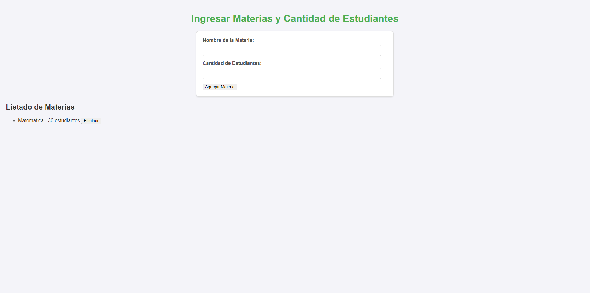
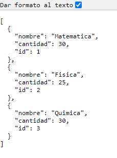
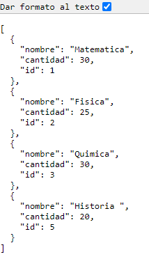
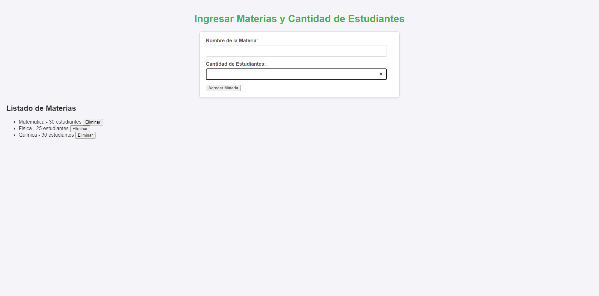

# Pruebas y Validación

En esta sección se documentan los casos de prueba para validar las funcionalidades de la aplicación de gestión de materias.

## Casos de Prueba

### 1. Agregar Materia

**Descripción:** Verificar que se puede agregar una nueva materia con un nombre y una cantidad de estudiantes.

- **Pasos:**
  1. Ingresar "Matemáticas" en el campo "Nombre de la Materia".
  2. Ingresar "30" en el campo "Cantidad de Estudiantes".
  3. Hacer clic en el botón "Agregar Materia".

- **Resultado Esperado:**
  - La materia "Matemáticas" con 30 estudiantes se agrega a la lista de materias.
  - La lista muestra: "Matemáticas - 30 estudiantes".

 

### 2. Listar Materias

**Descripción:** Verificar que todas las materias se muestran correctamente en la lista.

- **Pasos:**
  1. Agregar varias materias (por ejemplo, "Matemáticas", "Física", "Química").
  2. Observar la lista de materias.

- **Resultado Esperado:**
  - La lista debe mostrar todas las materias agregadas con sus respectivas cantidades de estudiantes.
  - Ejemplo: 
    - "Matemáticas - 30 estudiantes"
    - "Física - 25 estudiantes"
    - "Química - 20 estudiantes"

### 3. Eliminar Materia

**Descripción:** Verificar que se puede eliminar una materia existente.

- **Pasos:**
  1. Agregar una materia, por ejemplo, "Historia".
  2. Hacer clic en el botón "Eliminar" al lado de "Historia".

- **Resultado Esperado:**
  - La materia "Historia" ya no debe aparecer en la lista de materias.
  - La lista debe actualizarse correctamente.

    

  ### Reflexiones
  
  Durante el desarrollo de la aplicación, aprendí mucho sobre cómo gestionar datos en un entorno de servidor utilizando Node.js. Inicialmente, me resultó complicado entender cómo manejar las solicitudes HTTP y cómo estructurar mis rutas para que fueran eficientes. Al principio, encontré dificultades al intentar implementar las funciones para agregar, listar y eliminar materias, especialmente al mantener el estado de los datos (como los IDs de las materias) de manera consistente.

  Otro aspecto importante en el que trabajé fue la creación de una interfaz de usuario atractiva y funcional. Al principio, mi diseño era bastante simple y carecía de estilo, lo que no proporcionaba la mejor experiencia para el usuario. Me di cuenta de que una buena interfaz no solo mejora la estética de la aplicación, sino que también facilita la interacción del usuario con ella.
